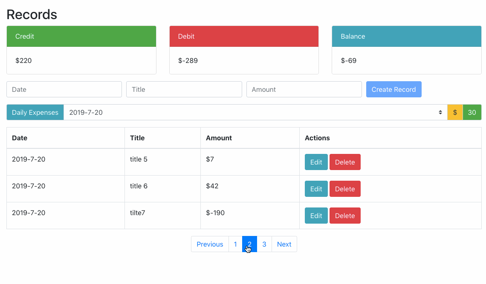

# 小型财务系统

React 实现的小型财务系统, 具有增删改查功能

[查看效果](https://hacker0limbo.github.io/react-intro-practice-code/accounts-app/)

## 项目预览



## 基本功能
- 查看总支出, 收入, 余额
- 添加, 删除, 更新一条记录
- 查看单个日期下的总余额
- 分页查看数据, 每页数据设置为最多三条

## 基本组件

```javascript
├─ RecordApp.js               // App
  ├─ AmountBox.js             // 计算金额组件
  ├─ RecordForm.js            // 添加记录组件
  ├─ DailyAmount.js           // 指定日期的支出组件
  ├─ RecordBody.js            // 数据展示组件
    ├─ Record.js              // 单条记录组件
    ├─ Loading.js             // 加载效果组件
    ├─ RecordPagination.js    // 分页组件
```

## 技术:
- react 
- axios
- bootstrap
- mockapi
