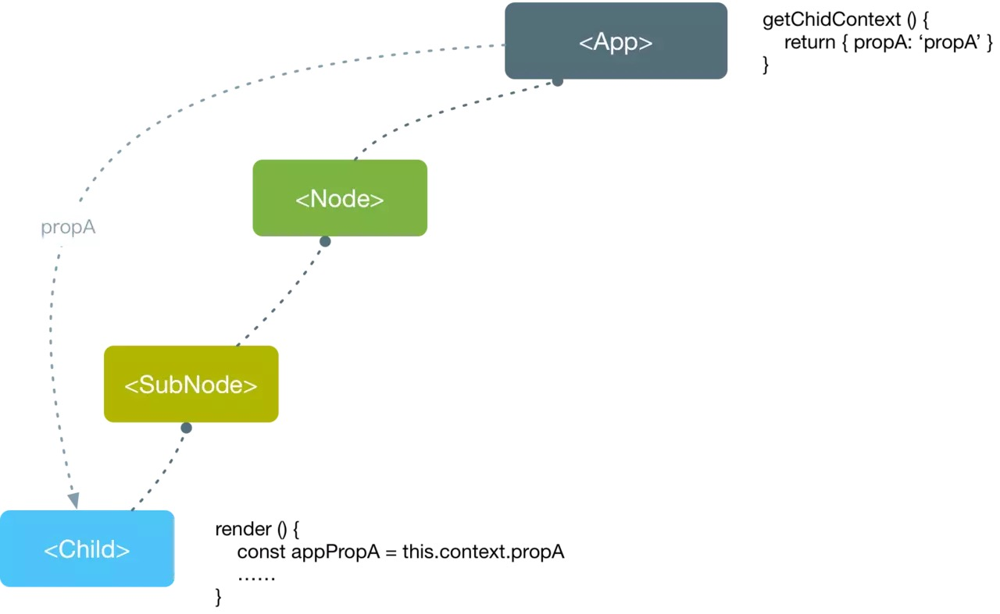

# 笔记

## key 属性
React 元素可以具有一个特殊的属性 key，这个属性不是给用户自己用的，而是给 React 自己用的, 当组件的子元素是一系列类型相同元素时，就必须添加一个属性 key, 如下

```jsx
{this.props.users.map(u => <div key={u.id}>{u.id}:{u.name}</div>)}
```

## 受控组件与非受控组件

### 受控组件
含义: 组件渲染的状态`state`与它的`value`或者`checked`相对应

每当表单 value 发生变化的时候(view), 组件 state 也发生更新

更新流程:
1. 可以通过在初始 state 中设置表单的默认值
2. 每当表单的值发生变化时，调用 onChange 事件处理器
3. 事件处理器通过合成事件对象 event 拿到改变后的状态，并更新 state
4. setState触发视图的重新渲染，完成表单组件值得更新

可以使用 es6 计算属性名进行更新

```javascript
handleChange() {
  const name = event.target.name
  const value = event.target.value
  this.setState({
    [name]: value
  })
}
```

### 非受控组件

与状态无关, 直接使用 ref 来获取值, 目的只是为了获取最后的结果的一个值

## 扩展运算符

可以用于合并(更新)对象, 如下:
```javascript
let ab = { ...a, ...b };
// 等同于
let ab = Object.assign({}, a, b);
```

如果用户自定义的属性，放在扩展运算符后面，则扩展运算符内部的同名属性会被覆盖掉
```javascript
let aWithOverrides = { ...a, x: 1, y: 2 };
// 等同于
let aWithOverrides = { ...a, ...{ x: 1, y: 2 } };
// 等同于
let aWithOverrides = Object.assign({}, a, { x: 1, y: 2 });

// a对象的x属性和y属性，拷贝到新对象后会被覆盖掉
```
因此可以用来修改现有对象的部分属性

如果将自定义属性放在扩展运算符前面, 变成了设置新对象的默认属性值
```javascript
let aWithDefaults = { x: 1, y: 2, ...a };
// 等同于
let aWithDefaults = Object.assign({}, { x: 1, y: 2 }, a);
```

## 单向数据流



关于数据流, 数据永远是从父组件流向子组件, 子组件通过回调函数将更新至传递给父组件, 父组件再使用 props 传回给子组件

在设计 state 的时候要保证在父组件更新的数据能正确返回流动到子组件, 否则不符合单向数据流

## 数据的更新

由于 setState, 所以永远需要返回一个新的 object, 可以使用 map, filter 等操作

具体查看 https://redux.js.org/recipes/structuring-reducers/immutable-update-patterns

**监听**: 对于一些数据, 比如这里的 credit, debit 和 balance 数据, 由于他们的更新是和不同组件里面的 state 的更新有关, 而每次各个子组件的更新都会触发父组件里面的 `render()`方法, 因此实现方法为在 render 里面也直接调用这些函数

## 加载数据

数据的加载在父组件的`componentDidMount()`这个生命周期方法里加载, 对于数据在子组件的加载的影响, 可以做如如下设置:
- state 里面添加 isLoaded 类似属性, 进行判断是否渲染子组件
- 在子组件里判断传递的 props 是否为空等, 根据情况渲染自己或者加载组件

## 一些命名
- 父组件传递 props 回调函数一般为`handleActionChild`, 子组件对应的方法为`handleAction`

## 部署问题

https://stackoverflow.com/questions/51918854/how-to-deploy-create-react-app-to-gh-pages-subfolder