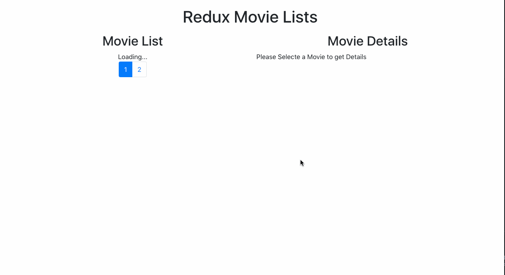

# movie list redux

使用 redux 完成的电影列表, api 来自: https://ghibliapi.herokuapp.com/

效果图:

## 一个小总结
子组件也可以使用`connect`进行连接到`redux`, 那么这个子组件就不再是一个展示组件了, 此时就变成了一个容器组件.

如果想要仍旧让他是一个展示组件, 数据的获取就需要来自父组件的`props`传递

之前 redux 提倡在父组件设置 connect 作为容器组件, 子组件均为展示组件. 后来不再提倡这个做法, 改为: **如果父组件通过复制向下传递了过多无意义的数据(也就是说过多的触碰了子组件的数据), 那么是时候将一些展示组件变成容器组件了**