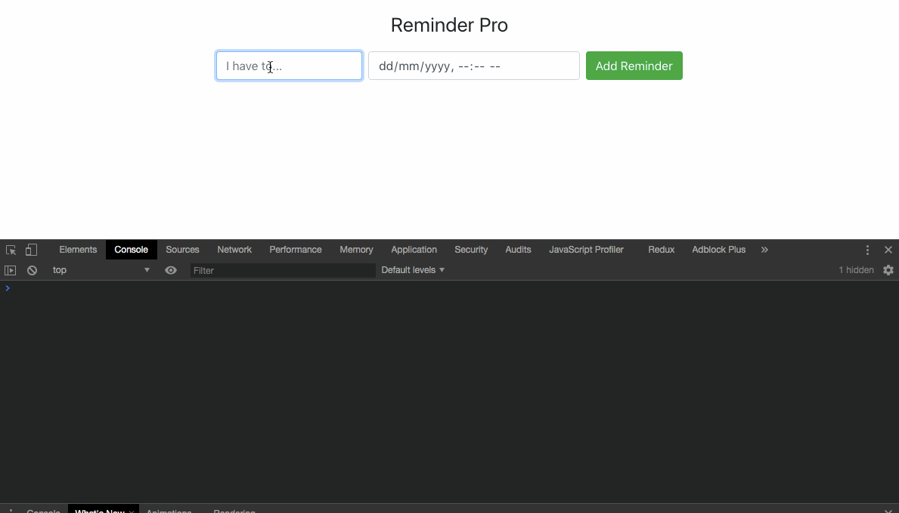

# Reminder Pro

使用 react + redux 实现的代办项目, 数据存在 cookies 中

预览效果:

## 思考

redux 就是将数据集中到 Stroe 中, 那个组件要哪个对应的 state, connect 一下就可以拿到对应的 state 和 action, 然后就可以愉快的 dispatch 来更新 state 了, 永远不用再做 props 传递数据给子组件了, reducer 会帮你处理好一切, 要做的只是 connect 一下...